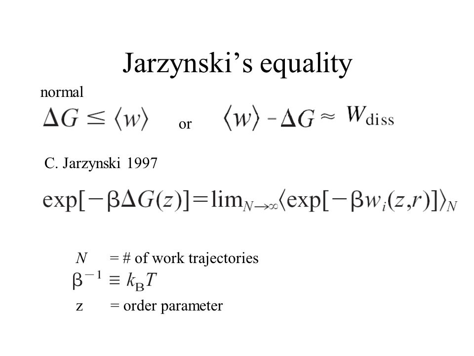

# Jarzynski Tool
This repository contains a python script, which allows to rebuild the PMF based on the Jarzysnki Equality framework. For this you need to pass a file in CSV format, where you have the work values ​​(kcal/mol/A) of all the replicas, the first column has to be the distance in (Angstrom). If you have any questions, you can contact me at groponp@gmail.com.



## Usage Jarzynski 
```bash
python jarzynski.py pmf --usage 

#! Return 
[USAGE    ] "%opt1: python jarzynski.py pmf -f work_matrix.csv -o reconstructed_PMF.csv -t 300 -e gmx"
[USAGE    ] "%opt2: python jarzynski.py pmf --file=work_matrix.csv --ofile=reconstructed_PMF.csv --temperature=300 --engine=gmx"
```

## Usage Kd 
```bash
python jarzynski.py kd --usage 

#! Return 
[USAGE    ] "%opt1: python jarzynski.py kd -f PMF.csv -o kd.csv -u nM -b 1000 -t 300 -e gmx"
[USAGE    ] "%opt2: python jarzynski.py kd --file=PMF.csv --ofile=kd.csv --units=nM --box_volume=1000 --temperature=300 --engine=gmx"
```


## License 
[GPLv3](https://www.gnu.org/licenses/gpl-3.0.en.html)